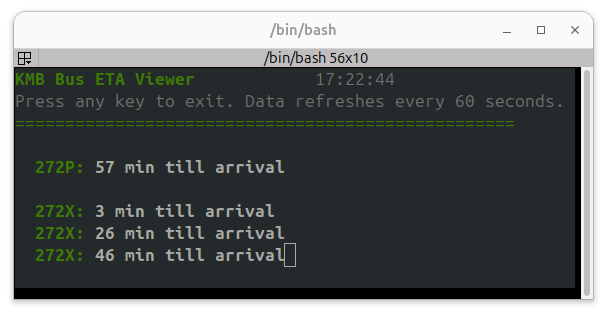

# :oncoming_bus: KMB Bus ETA TUI

A TUI to display real-time bus arrival information for KMB buses in Hong Kong.  
Add new Routes in `conf/bus_routes.yaml`. 🚏

## 📄 API Documentation  
https://data.etabus.gov.hk/datagovhk/kmb_eta_api_specification.pdf

## 🚀 Usage

1. 🔍 Find the Bus Stop ID from https://data.etabus.gov.hk/v1/transport/kmb/stop and search for your bus stop.
2. ✏️ Edit `conf/bus_routes.yaml` to add your desired bus routes and stop IDs.  
   `<choose a name for the route>`: "`<bus_stop_id>/<bus_route>/<operation_mode usally 1>`"
3. ▶️ Run the script `scripts/get_stop_ETA.py` to start the TUI.
