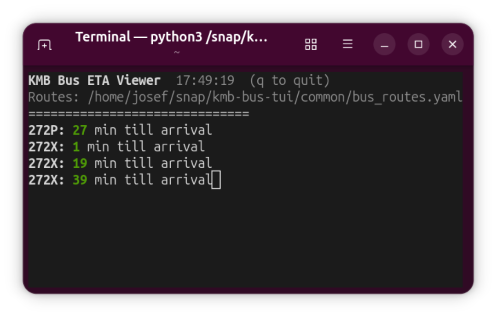

# :oncoming_bus: KMB Bus ETA TUI

A TUI to display real-time bus arrival information for KMB buses in Hong Kong.  



## 📄 API Documentation  
https://data.etabus.gov.hk/datagovhk/kmb_eta_api_specification.pdf

## 🚀 Usage

1. 🔍 Find the Bus Stop ID from https://data.etabus.gov.hk/v1/transport/kmb/stop and search for your bus stop.
2. ▶️ Run `uv run kmb-bus-tui` to start the TUI.
3. ✏️ Edit your routes file to add bus routes and stop IDs:
   - Normally: `~/.config/kmb-bus-tui/bus_routes.yaml`
   - When installed as a snap: `$SNAP_USER_COMMON/bus_routes.yaml` (e.g. `~/snap/kmb-bus-tui/common/bus_routes.yaml`)

   The file is created for you on first run, seeded with an example route. Each entry follows:  
   `<choose a name for the route>`: "`<bus_stop_id>/<bus_route>/<operation_mode usually 1>`"

   The running TUI also shows the active routes-file path at the top of the screen.

## 📦 Building the snap

The project ships a `snap/snapcraft.yaml` (strict confinement, `core24` base, `network` plug only — routes are stored under `$SNAP_USER_COMMON`, so no `home` interface is needed).

```bash
sudo snap install snapcraft --classic   # if snapcraft isn't installed yet
cd KMB_Bus_TUI
snapcraft                               # builds ./kmb-bus-tui_0.1.0_amd64.snap
sudo snap install --dangerous ./kmb-bus-tui_0.1.0_amd64.snap   # --dangerous = unsigned local build
kmb-bus-tui
```

Useful while iterating:
- `snap connections kmb-bus-tui` — check granted interfaces.
- `snapcraft clean` — force a clean rebuild (needed after changing `stage-packages`/plugin config).
- `sudo snap remove kmb-bus-tui` — uninstall a test build.
- Routes file when running as a snap: `~/snap/kmb-bus-tui/common/bus_routes.yaml`.

Publishing to the Snap Store (optional): `snapcraft register kmb-bus-tui`, then `snapcraft upload ./kmb-bus-tui_0.1.0_amd64.snap`.
